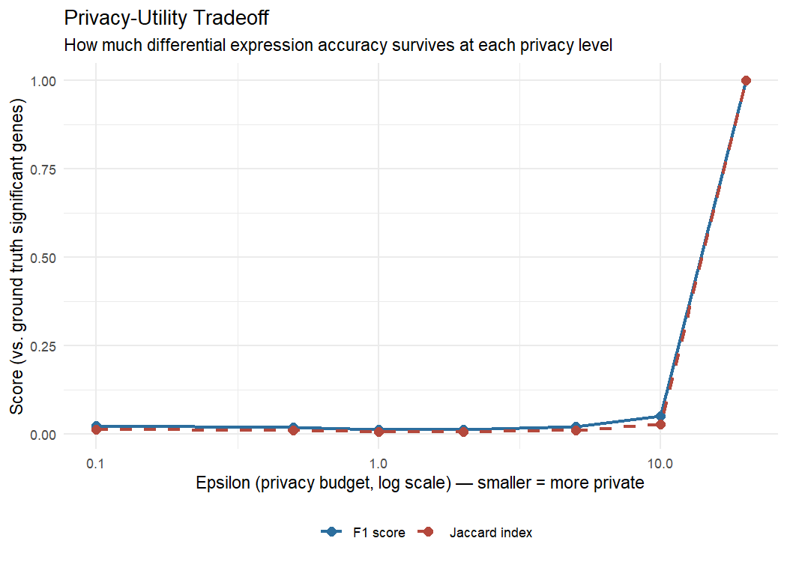
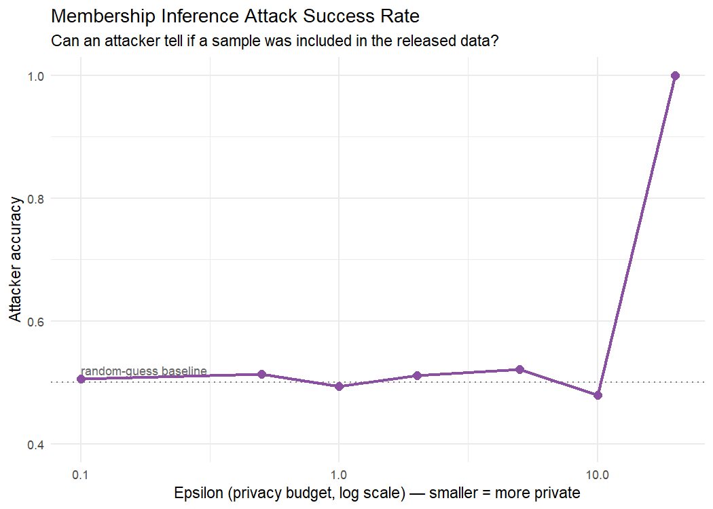

# Differential Privacy for Genomic Data Sharing

## Overview

This project demonstrates and quantifies the **privacy-utility tradeoff** in
genomic data sharing using differential privacy — the same class of
technique real institutions use (or should use) when releasing gene
expression data for research while protecting individual participants from
re-identification.

**The question this project answers:** How much statistical accuracy do you
have to give up to protect participants from having their presence in a
study detected — and how much protection do you actually get in return?

## Why this project

Genomic data is uniquely re-identifying: an individual's expression profile
can be distinctive enough that even "anonymized" release of aggregate
statistics can leak whether they participated in a study (a **membership
inference attack**). This project implements the standard defense
(the **Laplace mechanism**, the foundational tool of differential privacy)
and empirically measures both sides of the tradeoff on real RNA-seq data,
rather than treating it as a purely theoretical concern.

This sits at the intersection of my cybersecurity background and
computational genomics — most bioinformatics portfolios demonstrate the
biology side; this one demonstrates the security side computationally, on
real data.

## Data source

- **Dataset:** [`airway`](https://bioconductor.org/packages/release/data/experiment/html/airway.html) —
  a built-in Bioconductor RNA-seq dataset: airway smooth muscle cells,
  treated vs. untreated with dexamethasone (n=8, 4 vs. 4)
- Ships directly inside the `airway` R package — **no external download
  required**, unlike TCGA-scale projects
- Chosen deliberately for this project: small enough to re-run differential
  expression dozens of times across privacy levels in seconds rather than
  hours, and it's the same dataset used in DESeq2's own official
  documentation, so it's a recognized benchmark

## Pipeline

| Script | Purpose |
|---|---|
| `scripts/01_load_data.R` | Loads the airway dataset |
| `scripts/02_ground_truth_de.R` | Runs real (non-private) DESeq2 differential expression — the baseline everything else is measured against |
| `scripts/03_dp_mechanism.R` | Implements the Laplace mechanism; generates privatized count matrices at 7 privacy levels |
| `scripts/04_utility_tradeoff.R` | Re-runs DE on each privatized matrix; measures Jaccard/precision/recall/F1 vs. ground truth |
| `scripts/05_membership_inference.R` | Simulates a membership inference attack; measures attack success rate at each privacy level |
| `scripts/06_visualization.R` | Produces the two headline tradeoff figures |

Run in order:

```r
source("scripts/01_load_data.R")
source("scripts/02_ground_truth_de.R")
source("scripts/03_dp_mechanism.R")
source("scripts/04_utility_tradeoff.R")
source("scripts/05_membership_inference.R")
source("scripts/06_visualization.R")
```

Total runtime: a few minutes, thanks to the small dataset — no multi-hour
downloads like a TCGA-scale project.

## Method notes 

- **Sensitivity via clipping:** the Laplace mechanism requires bounding how
  much one individual could possibly change the output. Every count is
  clipped to the 95th percentile before noise is added — otherwise a single
  extreme value could break the privacy guarantee.
- **Scoping honesty:** noise is applied independently per gene/sample as an
  illustration of the mechanism and its tradeoff. A production-grade private
  release of an entire count matrix requires formal **privacy budget
  composition** across every value released — that accounting is out of
  scope here. This project demonstrates the mechanism and measures its
  effect, not a deployment-ready private data release system.
- **Membership inference simplification:** the simulated attacker is
  assumed to already know both candidate "true" means (a common, somewhat
  strong assumption in membership inference research, used here to make the
  privacy/no-privacy contrast clean and interpretable) — this represents a
  strong-attacker scenario, useful for demonstrating the mechanism's
  protective effect at its edges.

## Results

- At epsilon = **Inf** (no privacy): F1 = ___, membership inference
  accuracy = ___
- At epsilon = **1**: F1 = ___, membership inference accuracy = ___
- At epsilon = **0.1** (strong privacy): F1 = ___, membership inference
  accuracy = ___ (should approach the 0.5 random-guess baseline)




## Tools & packages

- R / Bioconductor
- `airway` — built-in benchmark RNA-seq dataset
- `DESeq2` — differential expression (both ground-truth and privatized runs)
- `ggplot2` — visualization

## Project structure

```
genomic-privacy-analysis/
├── README.md
├── .gitignore
├── LICENSE
├── data/processed/       # gitignored intermediate files
├── scripts/               # numbered pipeline
├── results/                # tradeoff and attack CSVs
└── figures/                 # tradeoff figures
```

## License

MIT — see LICENSE file.
